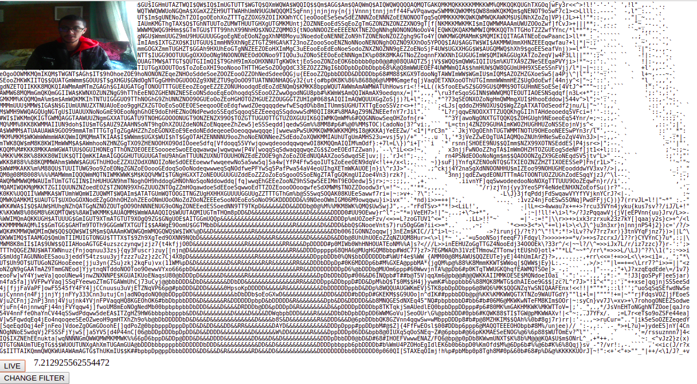
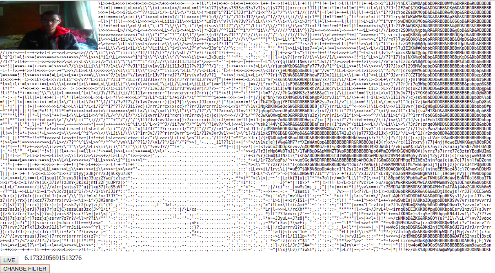
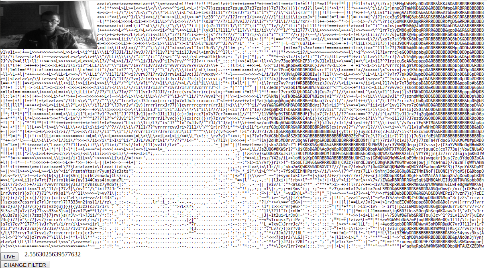
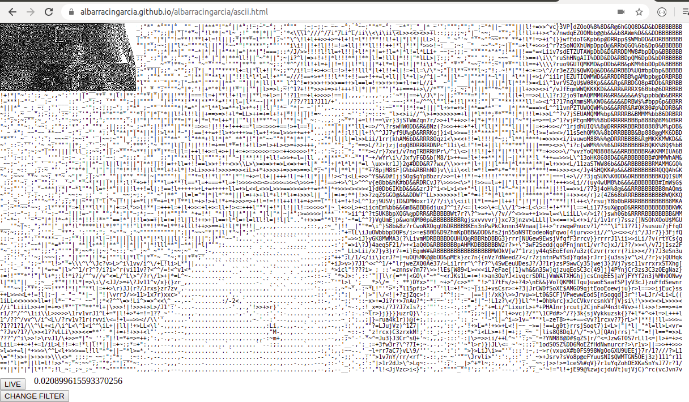
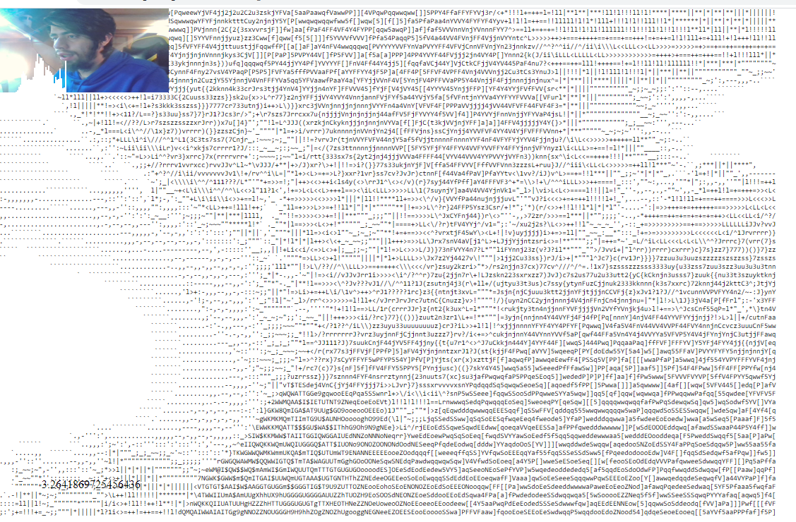
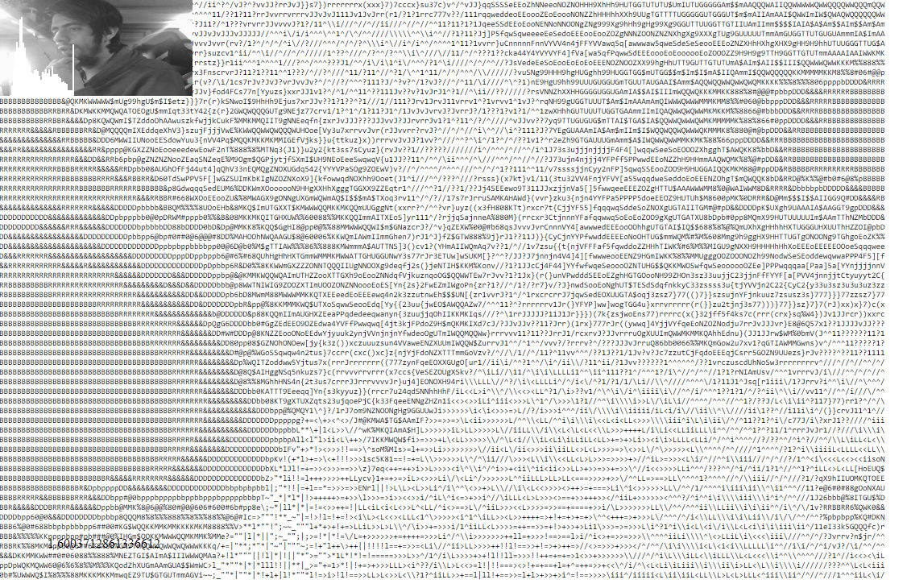
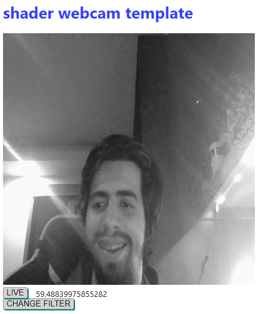
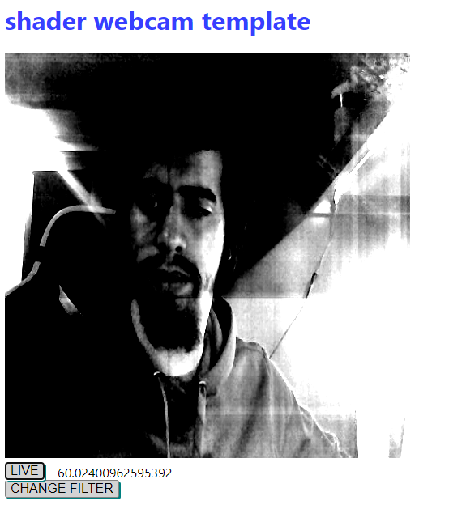

# PROYECTO DE ASCII 
[Ejercicio transormación por Software](./ascii.html).

[Ejercicio transormación por Hardware](https://dog-gabby-hyssop.glitch.me/).


## Motivación y objetivo

La capacidad tecnológica actual y las matemáticas aplicadas en los computadores, permiten innovar y profundizar en el campo de la visualización de datos en los sistemas computacionales; tal es el caso de la renderización de imágenes y videos, y cómo la llegada de equipos como tarjetas gráficas han potenciado este campo al aumentar la velocidad de los cálculos realizados por unidad de tiempo en esta misma renderización. En este trabajo se utilizan las técnicas de aplicación de filtros utilizando los recursos básicos de un computador que no posee tarjeta gráfica, como las técnicas de aquel que lo posee, comparando la velocidad de procesamiento expresado en FPS (frames por segundo) en cuestión de comparativa de filtros aplicados a videos, y se halla el histograma de frecuencias de una escala de colores como medida comparativapara las imágenes, con el objetivo de ofrecer una perspectiva imparcial de los algoritmos utilizados y su rendimiento.

## Metodología

El proceso de manipulación de imágenes se dividió en dos partes: una parte basada en el software, utilizando algotitmos de filtros básicos; y otra parte basada en el hardware, la cual contó con algoritmos de manipulación de shaders que utilizan los recursos de la tarjeta gráfica para realizar las operaciones.

### Manipulación de imágenes y video por software

Para la manipulación de imágenes y video por software, se aplicaron tres filtros, los cuales son: 1) filtro ASCII; 2) filtro grayScale; y 3) filtro Sharpen. A continuación se explica cada uno de estos. Los videos son captados desde la cámara, por lo cual, el sistema aplica los filtros en vivo y en tiempo real, y estos son mostrados con el filtro aplicado, también, en tiempo real.

#### Filtro ASCII

Para el filtro ASCII se creó una variable ``` options ```, que almacena las cadenas de caracteres con las que será conformada la imagen o video input. para este filtro se usa la función ```draw```, que se encarga de seleccionar entre los filtros existentes. Para el caso del ASCII, se selecciona que sea verdadera la variable ```ascii``` (cabe señalar que para cada filtro existe una variable inicializada en ```false```, que se hará ```true``` cuando sea llamada y, por tanto, aplicada a la imagen), y esto llama a la siguiente función:
```
function getOptions() {
 if (reverse) {
    return reversedOptions;
 }
 return options;
}
```
la cual retorna la variable options en caso de que se requiera una imagen ASCII con caracteres oscuros pasa espsacios oscuros;¿por qué se dice esto? Porque también se hizo un filtro que se basa en la variable ```options``` pero reversada, para hacer los espacios oscuros de la imagen como espacios claros en el ASCII, y los espacios claros de la imagen como espacios oscuros.







#### Filtro grayScale

Este filtro, como su nombre lo dice, convierte una imagen en escala de grises. Este proceso se hace mediante el promedio RGB de cada pixel, traducido a un nivel de brillo en el cual el valor 0 es el negro, y el valor 255 es el más claro; así, pues, un color fuerte representará un gris claro en la imagen transformada, y un color débil u oscuro, representará un gris ms oscuro en la imagen transformada. Todo esto se hace utilizando la función ```toBlackAndWhite()```.




#### Filtro convolución

Para aplicar la convolución, se dispone de una matriz de convolución 3x3, la cual, realizando un cálculo de producto punto con la sub-imagen (una porción de la imagen original compuesta por una matriz de brillo de pixeles 3x3), le aplica diferentes filtros a la imagen original. En este caso, se utilizó el filtro Sharpen, compuesto por una matriz de convolución [[0,-1,0],[-1,5,-1],[0,-1,0]] distorsiona la imagen original con un particular filtro.




## Histograma
A continuación se presentan los histogramas de las imágenes original y blanco y negro.  Se muestrean sobre la imagen que capta la cámara, la cual puede ser la imagen captada original o bajo el efecto de un filtro. Este histograma representa la distribución de grises presente en la imagen, yendo de más oscuro a más claro, y se imprime desde la posición cero de la imagen, hasta una porción de esta.






### Manipulación de imágenes y video por hardware

Los siguientes filtros fueron realizados utilizando shaders, que hacen uso del hardware del equipo para procesar las imágenes y los videos.

#### Filtro grayScale

Para hacer este filtro, se promedia cada pixel, se divide por tres y se le asigna en brillo el resultado dado a dicho pixel.




#### Filtro convolución

Al igual que en la convolución con software, se utiliza una matriz de convolución, que en este caso se define en;
```
float sharpenFilter[9];
  sharpenFilter[0] = 0.0;
  sharpenFilter[1] = -1.0;
  sharpenFilter[2] = 0.0;
  sharpenFilter[3] = -1.0;
  sharpenFilter[4] = 5.0;
  sharpenFilter[5] = -1.0;
  sharpenFilter[6] = 0.0;
  sharpenFilter[7] = -1.0;
  sharpenFilter[8] = 0.0;
```
acompañado de lo que permite acceder a la tarjeta gráfica, que son los vectores vec4. utilizados para archivos .frag, acompañados de los sampler2D y los vectores Varying.




## Resultados y conclusiones

Se observa que el filtro de escala de grises utilizando software, se ejecuta a poco ms de 2 frames, mientras que el mismo utilizando hardware, se ejecuta a 59 frames. Algo no tan similar sucede con los filtros de convolución, donde el que utiliza hardware se ejecuta a 60 frames, pero el que utiliza software se ejecuta a 0.02 frames, lo cual lo hace inviable para hacer un video en vivo.

En cuanto a la distribución de frecuencia de las escalas de gris, representadas por el histograma que se ubica sobre las imágenes, se observa que a medida que la imagen tiene más colores claros, el histograma tiene mayor área sobre la parte derecha, y viceversa.

A partir del informe, se concluye que los recursos de hardware incrementan en gran medida la manera en la que son procesadas las imágenes y los videos, pero asimismo los algoritmos que utiliza son más elaborados. Los temas de investigación que tiene este campo son variados y pueden explotarse con el equipo adecuado en materia de memoria y poder de procesamiento.


## Trabajo de indagación futuro

Debido al interés de los integrantes del equipo por la manipulación de imágenes y videos, y la manera en la que estas pueden ser renderizadas utilizando diferentes filtros y técnicas algorítmicas, estos han decidido profundizar para un proyecto de manipulación de imágenes out-of-core o multiresolución (también llamadas megaimágenes), con el objetivo de aportar al área de investigación de las herramientas computacionales que facilitan la visualización (navegación o filtros) de imágenes médicas.
